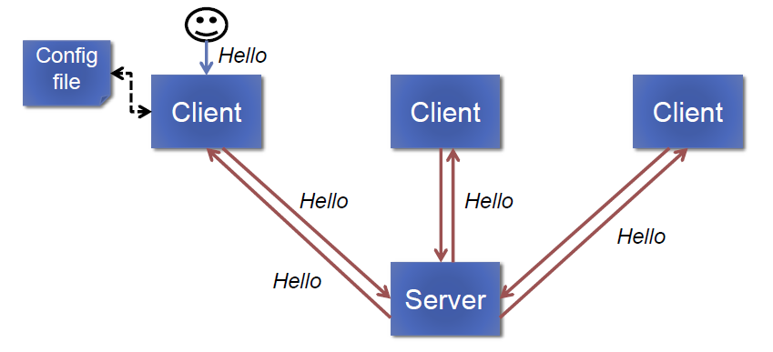

# Message Broadcaster Demo

A message broadcaster implemented in a client-server architecture to demonstrate the use of multi-threading and socket communication in J.

* Clients read server IP/port from config file
* Clients establish a TCP connection with the server
* Users type a message using the console, the client sends it to the server, the server broadcasts that message to all clients currently connected (including the sending client) and the clients display the message to the user.

